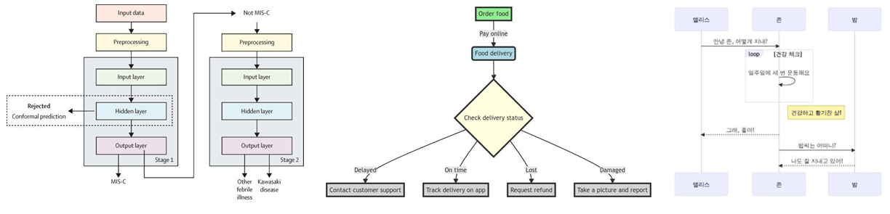
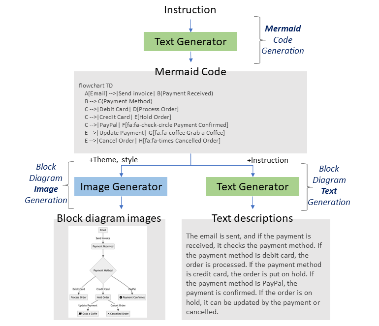
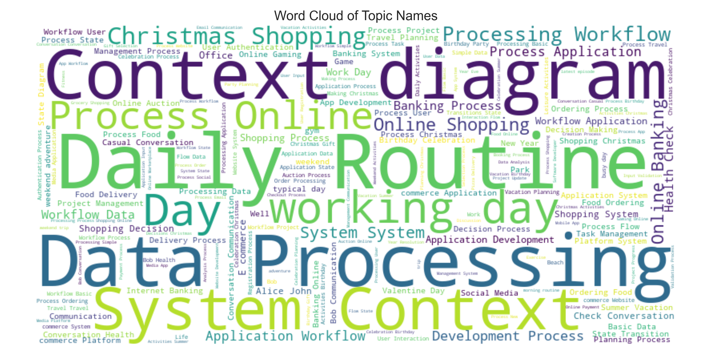
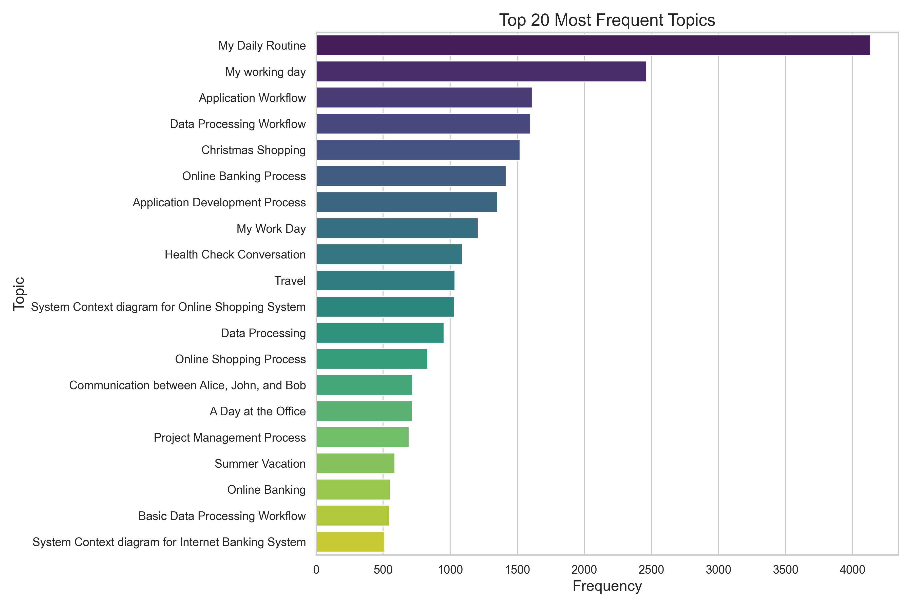

<div align="center">
    
# Unveiling the Power of Integration: Block Diagram Summarization through Local-Global Fusion

[](#how-to-cite)
[](#demo)

Official Implementation of BD-EnKo Dataset and Generator

</div>

## Introduction

**BD-EnKo** dataset provides a diverse and high-quality benchmark dataset in English and Korean for block diagram understanding. This dataset is created using our innovative data collection methodology, ensuring flexibility and scalability to support a wide range of applications in both languages.

The official implementation of the BlockNet model is available in this [GitHub](https://github.com/shreyanshu09/BlockNet) repository.

## Datasets

<p align="center">
  
</p>


The links to the datasets are here:

- [`BD-EnKo`](https://huggingface.co/datasets/shreyanshu09/BD-EnKo): 83,394 samples.
- [`Complete Dataset`](https://huggingface.co/datasets/shreyanshu09/Block_Diagram): 84,925 samples.

*Complete Dataset* is the full dataset used to train the *global information extractor model*. It includes BD-EnKo, CBD, FC_A, and FC_B datasets.

## Dataset Format

This dataset follows the given structure:

```bash
> tree dataset_name
dataset_name
├── train
│   ├── metadata.jsonl
│   ├── {image_path0}
│   ├── {image_path1}
│             .
│             .
└── validation
    ├── metadata.jsonl
    ├── {image_path0}
    ├── {image_path1}
              .
              .

> cat dataset_name/train/metadata.jsonl
{"file_name": {image_path0}, "ground_truth": "{\"gt_parse\": {\"c2t\": \"{ground_truth_parse}\"}}"}
{"file_name": {image_path1}, "ground_truth": "{\"gt_parse\": {\"c2t\": \"{ground_truth_parse}\"}}"}
     .
     .
```

- The structure of `metadata.jsonl` file is in [JSON Lines text format](https://jsonlines.org), i.e., `.jsonl`. Each line consists of
  - `file_name` : relative path to the image file.
  - `ground_truth` : string format (json dumped), the dictionary contains `gt_parse`.


## Dataset description

This dataset contains different types of block diagram images with their high-quality summaries.

| Types           | Train |         | Validation |         |
|-----------------|-------|---------|------------|---------|
|                 | English | Korean | English    | Korean  |
|-----------------|---------|--------|------------|---------|
| Flowchart       | 7,875   | 7,678  | 875        | 854     |
| GraphLR         | 5,462   | 2,861  | 607        | 318     |
| GraphTD         | 3,500   | 2,402  | 389        | 267     |
| Journey         | 8,494   | 8,858  | 942        | 985     |
| Sequence        | 2,708   | 3,539  | 301        | 394     |
| Simple Graph    | 3,825   | 1,194  | 425        | 133     |
| State Diagram   | 6,444   | 6,265  | 717        | 693     |
| C4              | 3,549   | 0      | 395        | 0       |
| Real World      | 76      | 304    | 15         | 50      |
|-----------------|---------|--------|------------|---------|
| **Total**       | **41,933** | **33,101** | **4,666**    | **3,694** |


## Dataset Generator

`data_generation.ipynb` file serves as a versatile tool for creating a wide range of block diagrams in any desired language. By modifying key parameters such as the prompt, theme, and block diagram category, users can easily generate various types of block diagrams to meet specific needs. This flexibility allows for customization in the design and labeling of diagrams, accommodating diverse requirements across different fields and applications. 


<p align="center">
  
</p>


## Topics

It contains a wide variety of topics.






## Contact

If you have any questions about this work, please contact **[Shreyanshu Bhushan](https://github.com/shreyanshu09)** using the following email addresses: **shreyanshubhushan@gmail.com**.
